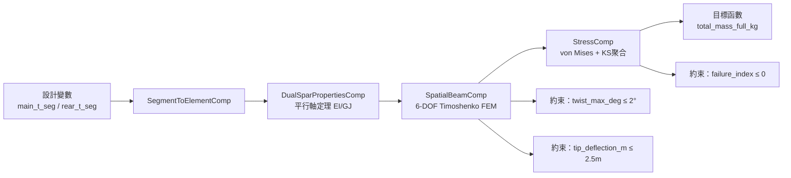

# HPA-MDO：人力飛機多學科設計最佳化框架

一套用於人力飛機巡航外形、逆向求形與結構落地的 Python 框架，整合了氣動力載荷解析、inverse design、有限元素分析與 CAE 匯出功能。專為 **Black Cat 004**（翼展 33 m 的人力飛機）而建。

目前這個 repo 的正式主線不是舊的單梁 parity 路線，也不只是 decision producer 包裝層，而是 **`VSP / target cruise shape -> inverse design -> jig shape -> realizable loaded shape -> CFRP / discrete layup`** 這條可持續擴充的工程主線。第一次進 repo 時，請把它當成「可執行的設計引擎 + 正式輸出 contract」，不要把 `equivalent_beam` 或零散研究型 script 當成目前 sign-off 入口。

---

## 你現在應該看哪裡

| 你現在要做什麼 | 先看哪裡 | 為什麼 |
|---|---|---|
| 想先知道「現在真正主線到底是什麼」 | [CURRENT_MAINLINE.md](CURRENT_MAINLINE.md) | 這份是目前正式主線的單一真相文件 |
| 第一次進 repo，想知道怎麼開始 | [README.md](README.md) | 這份就是 landing page，先用它判斷正式入口與第一個指令 |
| 想直接拿可畫圖的正式輸出 package | [docs/drawing_ready_package.md](docs/drawing_ready_package.md) | 這份會直接告訴你哪個 STEP 拿去畫、哪些只是參考 |
| 想快速找到所有重要文件 | [docs/README.md](docs/README.md) | 文件索引，會告訴你哪些是正式 contract、哪些是研究/歷史文件 |
| 想知道最近該做什麼、不該先做什麼 | [docs/NOW_NEXT_BLUEPRINT.md](docs/NOW_NEXT_BLUEPRINT.md) | 近期路線圖與優先順序 |
| 想看更細的近期進度與分軌方向 | [docs/EXECUTION_ROADMAP.md](docs/EXECUTION_ROADMAP.md) | 細化版執行路線圖；會告訴你不同卡點應該先推哪條線 |
| 想接續「從頭設計人力飛機外型」這條線 | [docs/superpowers/plans/2026-04-22-birdman-upstream-concept-master-roadmap.md](docs/superpowers/plans/2026-04-22-birdman-upstream-concept-master-roadmap.md) + [docs/superpowers/reports/2026-04-24-birdman-mass-closure-rerun.md](docs/superpowers/reports/2026-04-24-birdman-mass-closure-rerun.md) | 這條線稱為 **Birdman Upstream Concept Line**，短名 `birdman-upstream-concept` |
| 想把任務平行派給其他 AI | [project_state.yaml](project_state.yaml) + [docs/task_packs/current_parallel_work/README.md](docs/task_packs/current_parallel_work/README.md) | 一份給機器讀的真相檔，加上一包可直接派工的 task pack |
| 想接續主翼 mesh-native CFD / SU2 這條暫停線 | [mesh_native_cfd_line_freeze.v1.md](hpa_meshing_package/docs/reports/mesh_native_cfd_line_freeze/mesh_native_cfd_line_freeze.v1.md) | 這條線已暫停；先讀這份，裡面列出所有 mesh/SU2 方法、失敗原因、物理疑點與下一步 |
| 想理解長期願景與五階段藍圖 | [docs/GRAND_BLUEPRINT.md](docs/GRAND_BLUEPRINT.md) | 長期 blueprint，不是日常入口 |

## 三條閱讀路徑

### 第一次使用

1. 先看下面的「安裝方式」與「快速開始」。
2. 跑一次 `python examples/blackcat_004_optimize.py` 或 `python scripts/run_optimization.py --config configs/blackcat_004.yaml`。
3. 如果要理解正式工程主線，再讀：
   - [CURRENT_MAINLINE.md](CURRENT_MAINLINE.md)
   - [docs/dual_beam_workflow_architecture_overview.md](docs/dual_beam_workflow_architecture_overview.md)
   - [docs/NOW_NEXT_BLUEPRINT.md](docs/NOW_NEXT_BLUEPRINT.md)

### 協作開發

- 先以本頁的「目前正式判準」為準，確認不要沿用 legacy parity path。
- 接著讀：
  - [CURRENT_MAINLINE.md](CURRENT_MAINLINE.md)
  - [docs/dual_beam_workflow_architecture_overview.md](docs/dual_beam_workflow_architecture_overview.md)
  - [docs/NOW_NEXT_BLUEPRINT.md](docs/NOW_NEXT_BLUEPRINT.md)
  - [docs/GRAND_BLUEPRINT.md](docs/GRAND_BLUEPRINT.md)

### 從頭設計 Birdman 概念外型

這條線的溝通名稱是 **Birdman Upstream Concept Line**（短名 `birdman-upstream-concept`），目標是從規則、環境、騎手功率、質量與概念幾何開始，走到 AVL spanwise / zone requirements、bounded CST / airfoil selection、Julia/XFoil.jl polar evaluation，再回到 launch / turn / trim / local-stall / mission ranking。它不是 Black Cat 004 downstream `inverse design -> jig shape -> CFRP` 主線的替代品，而是把新的概念外型篩選好，再交給 downstream mainline 的上游入口。

先讀：

- [docs/superpowers/plans/2026-04-22-birdman-upstream-concept-master-roadmap.md](docs/superpowers/plans/2026-04-22-birdman-upstream-concept-master-roadmap.md)
- [docs/superpowers/reports/2026-04-24-birdman-mass-closure-rerun.md](docs/superpowers/reports/2026-04-24-birdman-mass-closure-rerun.md)

主要入口：

- `configs/birdman_upstream_concept_baseline.yaml`
- `scripts/birdman_upstream_concept_design.py`
- `src/hpa_mdo/concept/`
- `tools/julia/xfoil_worker/`

### AI / automation

- 正式對外 machine-readable 入口是 `python -m hpa_mdo.producer` 輸出的 decision interface JSON。
- 如果只需要 consumer contract，請優先讀：
  - [docs/dual_beam_consumer_integration_guide.md](docs/dual_beam_consumer_integration_guide.md)
  - [docs/dual_beam_decision_interface_v1_spec.md](docs/dual_beam_decision_interface_v1_spec.md)
  - [docs/dual_beam_autoresearch_quickstart.md](docs/dual_beam_autoresearch_quickstart.md)

---

## 架構概觀

```
         configs/blackcat_004.yaml         參考 .vsp3（幾何真值）
                   |                              |
                   v                              v
          +-----------------+             +------------------+
          | Config (Pydantic)|  ───────▶  | VSPBuilder       |
          | core/config.py   |            | aero/vsp_builder |
          +-----------------+             +------------------+
                   |                              |
                   v                              v
          +-----------------+             +------------------+
          | VSPAero Parser  |             | Aircraft Builder  |
          | aero/vsp_aero   |             | core/aircraft     |
          +-----------------+             +------------------+
                        \                /
                         v              v
                    +------------------------+
                    |   Load Mapper           |
                    |   aero/load_mapper      |
                    +------------------------+
                                |
                                v
                    +------------------------+
                    |  OpenMDAO FEM Solver    |
                    |  (6-DOF Timoshenko)     |
                    |  structure/oas_struct   |
                    +------------------------+
                                |
                                v
                    +------------------------+
                    |  Spar Optimizer         |  → disp (uz, θy)
                    |  structure/optimizer    |
                    +------------------------+
                        |        |         |
                        v        v         v
          +----------------+  +--------+  +-----------------------+
          | ANSYS Export   |  | Plots  |  | CruiseVSPBuilder       |
          | APDL/CSV/BDF  |  +--------+  | aero/cruise_vsp_builder|
          +----------------+              +-----------------------+
                                                    |
                                                    v
                                          +-----------------+
                                          | vsp_to_cfd.py   |
                                          | STEP / STL      |
                                          +-----------------+
                                                    |
                                                    v
                        [Hi-Fi 驗證層：local structural spot-check]
                               Gmsh → CalculiX → ParaView
                               ASWING（依本機 binary） / SU2（長期）
```

### OpenMDAO Component DAG



---

## 功能特色

- **基於 OpenMDAO 的 6-DOF Timoshenko 梁有限元素模型**（SpatialBeam 配方），具解析導數
- **分段碳纖維管設計** -- 11 根管材，每根 3.0 m，半翼展建模為 6 段 [1.5, 3.0, 3.0, 3.0, 3.0, 3.0] m
- **雙梁主線結構分析** -- `dual_beam_mainline` / `dual_beam_production` 是目前正式 structural truth；`equivalent_beam` 只保留為 legacy parity / regression 路徑
- **升力鋼索支撐** -- 在鋼索連接接頭位置施加垂直撓度約束條件
- **VSPAero 整合** -- 解析 `.lod`（展向載荷）與 `.polar`（積分係數）輸出檔案
- **ANSYS APDL / Workbench CSV / NASTRAN BDF 匯出** -- 自動生成用於獨立有限元驗證的輸入檔案
- **FastAPI + MCP 伺服器**，用於 AI 代理整合（Claude Code、遠端批次作業、網頁儀表板）
- **代理模型訓練資料收集** -- 將設計評估結果寫入 CSV 供機器學習模型訓練
- **獨立的安全係數** -- `aerodynamic_load_factor` 用於載荷，`material_safety_factor` 用於容許應力（永不混用）
- **外部材料資料庫** -- 所有材料屬性以鍵值方式從 `data/materials.yaml` 載入

---

## 目前正式判準

這個 repo 目前有兩條容易混淆的結構路線，請以這裡為準：

- **正式 structural truth / 設計判準**：`src/hpa_mdo/structure/dual_beam_mainline/` 的 `dual_beam_production` 模式，以及其上游的 joint workflow / producer 輸出。
- **正式對外 consumer contract**：`python -m hpa_mdo.producer` 產出的 decision interface JSON。
- **legacy parity path**：`equivalent_beam` 與 `scripts/ansys_crossval.py --export-mode equivalent_beam` 只保留為歷史 Phase I parity / regression 參考，不應再當成目前的設計 sign-off、排名基準或高保真比對目標。
- **高保真幾何/驗證目標**：應優先對齊 dual-beam production / inverse-design artifacts，例如 production check report、selected design summary、`spar_jig_shape.step`、loaded-shape artifacts；不要預設拿 `output/blackcat_004/optimization_summary.txt` 或 `spar_model.step` 當最後真值。

如果你是人或 AI 代理，對 Black Cat 004 的後續開發請優先讀：

- [docs/dual_beam_workflow_architecture_overview.md](docs/dual_beam_workflow_architecture_overview.md)
- [docs/dual_beam_consumer_integration_guide.md](docs/dual_beam_consumer_integration_guide.md)
- [docs/GRAND_BLUEPRINT.md](docs/GRAND_BLUEPRINT.md)

---

## Birdman Upstream Concept Line（上游概念外型線）

**溝通名稱**：`Birdman Upstream Concept Line`，中文可叫「Birdman 上游概念外型線」，短名 `birdman-upstream-concept`。

這條線負責「從頭設計人力飛機概念外型」，也就是你提到的從 `wing span / wing loading / wing area / taper / twist` 開始，一路接到 AVL、airfoil/CST、Julia/XFoil.jl 與概念排名。它目前的流程是：

```text
Birdman rules / environment / rider power / mass
  -> span_m + wing_loading_target_Npm2 + taper/twist concept sampling
  -> derived wing_area_m2 + mass closure / gross-mass cap
  -> AVL-backed spanwise / zone requirements
  -> bounded CST / airfoil candidate selection
  -> Julia/XFoil.jl polar screening + finalist full-alpha sweep
  -> launch / turn / trim / local-stall / mission checks
  -> concept_summary.json / concept_ranked_pool.json / frontier_summary.json
  -> OpenVSP / downstream mainline handoff
```

目前進度：這條線已經不是假骨架。`scripts/birdman_upstream_concept_design.py` 可以用 `--worker-mode julia` 跑 real `julia_xfoil` worker，config 也已經把主要幾何變數改成 `span_m` + `wing_loading_target_Npm2`，`wing_area_m2` 則由翼載與 mass-closure 邏輯導出。`output/birdman_mass_closure_rerun_20260424/` 的最近一次 real Julia/XFoil run 評估了 40 個概念，沒有完全可行解；最佳診斷點約為 `span = 35.99 m`、`S = 38.09 m2`、`AR = 34.01`、`W/S = 27.35 N/m2`，主要失敗是 `local_stall + mission`，最佳航程約 `16.1 km`，距離 `42.195 km` 仍差很多。這個舊結果現在只保留作為「為什麼要改設計邏輯」的背景，不作為新設計標準。

主任務定義：這條線目前主 objective 命名為 **`fixed_range_best_time`**，中文稱「給定航程-最佳時間任務」。比賽航程 `R` 由 `mission.target_distance_km` 提出，預設為 `42.195 km`；若任一可飛速度能完成 `R`，mission score 以完賽時間 `R / V` 排序，但整體 concept ranking 仍先看 gate / feasibility margin，所以薄裕度高速解不會壓過裕度明顯更好的較慢完賽解。若不能完賽，則退回最大航程作為比較訊號。舊的 `max_range` 與 `min_power` objective 仍保留，可用於診斷或替代研究。

工程判讀：這條線現在的主設計方向改成 **35m 翼展上限-給定航程最佳時間任務線**，短名 `span_capped_fixed_range_best_time`。`span_m <= 35 m` 是目前使用者指定的工程邊界；外部審查中 `38..40 m` span、`AR 43..48` 的方向只能當參考，不能直接照搬。因為在 `b <= 35 m` 下，想提高 `AR = b^2/S` 只能靠降低 `S` / 平均弦長，而不是靠繼續拉 span；這會同步提高 cruise `CL`、低速 stall / launch 風險，並讓 tip Reynolds 更吃緊。

目前設計盒分兩條比較，而不是單一答案：

- `box_a`：safe-completion box，`span = 32..35 m`、`W/S = 26..31 N/m2`、`S` 約落在較保守的大翼面積側，目標是完賽裕度與低速安全。
- `box_b`：compact-high-AR box，`span = 33..35 m`、`W/S = 31..36 N/m2`、`S` 約落在 `28..34 m2`，目標是降低 profile drag / 提高 AR，但必須嚴格檢查 `CLmax`、launch、turn、tip-Re 與結構。

翼分布也不再只當報表背景。AVL / fallback station points 的 `cl * chord` spanload shape 會進入 `spanload_efficiency_proxy_v1`，再回饋到 mission induced drag / required power；因此 chord/taper/twist 造成的分布變化會改變任務功率。這仍然是 concept-stage proxy，不是 Trefftz-plane sign-off，但比固定用幾何 proxy 的 `e` 更符合目前的工程問題。

2m 級 tip deflection 是合理的 downstream jig / aeroelastic 設計目標，但目前 upstream concept 線只有很粗的 uniform-cantilever deflection gate，不能把 `2 m` 硬塞成 concept 排名標準。用目前 proxy 掃新的 35m 盒子時，accepted concepts 的 estimated tip deflection 約落在 `3.2..5.2 m`；這更像是在說「現在的 deflection model 沒有 wire support / jig-shape solve」，不是在說 2m 目標不合理。正確下一步是把 flight shape / jig shape / wire-braced beam loop 接進來，讓 `2 m` 變成 aeroelastic solve 的結果或目標，而不是只在 upstream proxy 裡貼標籤。

外部嚴格審查紀錄：

- [docs/superpowers/reports/2026-05-02-birdman-upstream-concept-gpt-pro-packet.md](docs/superpowers/reports/2026-05-02-birdman-upstream-concept-gpt-pro-packet.md) - 給 GPT Pro 的自包含偽代碼 / 公式 / 審查 prompt。
- [docs/superpowers/reports/2026-05-02-birdman-upstream-gpt-pro-review-response.md](docs/superpowers/reports/2026-05-02-birdman-upstream-gpt-pro-review-response.md) - GPT Pro 回覆後整理出的 decision-grade、Daedalus benchmark、rider endurance、prop / `CLmax` / structure 修正建議。

最新防誤判補強：`concept_summary.json`、`concept_ranked_pool.json`、`frontier_summary.json` 與候選 bundle 的 `concept_summary.json` 現在會輸出 `artifact_trust`，明確標示目前仍是 `diagnostic_only`，並列出 stub worker、worker fallback、missing polar、spanwise fallback、簡化 prop、OpenVSP 輸出關閉等非 decision-grade 原因。

歷史參考資料：`data/reference_aircraft/hpa_benchmarks.yaml` 保存 Daedalus 88 與 Light Eagle 的可解析 SI 基準值與來源 URL；目前用途是 mission-context reference，避免搜尋範圍排除歷史 HPA 量級，不是硬性標準，也不是要求 optimizer 複製歷史外型。

空氣性質表：`data/atmosphere/sea_level_air_20_40c.yaml` 保存 20-40 C、海平面乾空氣的 density / dynamic viscosity / kinematic viscosity；`hpa_mdo.concept.atmosphere` 會對非整數溫度做線性插值，並在 `relative_humidity` 非零時修正 density。Birdman concept pipeline 與 AVL spanwise Reynolds 現在都會引用這組 resolved air properties。

飛行員功率曲線：原始 CSV `data/pilot_power_curves/current_pilot_power_curve.csv` 不做 in-place 修改；旁邊的 `current_pilot_power_curve.metadata.yaml` 標記這份資料是在 `26 C / 70% RH` 量測。mission config 目前開啟 simplified heat-stress 修正，會用 `k = 0.008` 把曲線自動平移到比賽環境 `33 C / 80% RH`，summary artifact 會輸出 `pilot_power_thermal_adjustment` 供檢查。

推進 / 傳動初估：Birdman concept configs 目前採用 `eta_prop = 0.86`、`eta_trans = 0.96`，所以踏板到有效推進設計點效率 `eta_total = 0.8256`。這是巡航/爬升有前進速度的 sizing 值；螺旋槳直徑、轉速範圍、葉片數與 BEMT proxy 仍保留在 config surface，之後可替換成真實 prop design / map。

常用指令：

```bash
# real airfoil-worker route; may take minutes depending on cache and Julia state
PYTHONPATH=src ./.venv/bin/python scripts/birdman_upstream_concept_design.py \
  --config configs/birdman_upstream_concept_baseline.yaml \
  --output-dir output/birdman_upstream_concept_run \
  --worker-mode julia

# fast plumbing smoke only; do not use stubbed output as engineering evidence
PYTHONPATH=src ./.venv/bin/python scripts/birdman_upstream_concept_design.py \
  --config configs/birdman_upstream_concept_baseline.yaml \
  --output-dir .tmp/birdman_upstream_concept_stubbed \
  --worker-mode stubbed
```

---

## 安裝方式

需要 Python 3.10 以上版本。相容 Mac（Apple Silicon / Intel）及 Windows。

```bash
git clone https://github.com/Prosper1030/hpa-mdo.git
cd hpa-mdo
uv venv --python 3.10 .venv
.venv\Scripts\activate        # Windows
# source .venv/bin/activate   # macOS
uv pip install -e ".[all]"
```

選用相依套件群組：

| 群組 | 套件 | 用途 |
|------|------|------|
| `oas` | openaerostruct, openmdao | 有限元素求解器（最佳化必要） |
| `api` | fastapi, uvicorn | REST API 伺服器 |
| `mcp` | mcp | 供 AI 代理使用的 Model Context Protocol |
| `cad` | cadquery | STEP 幾何匯出 |
| `dev` | pytest, pytest-cov, ruff | 開發與測試 |
| `all` | 以上全部 | 完整安裝 |

使用 `pip install -e ".[oas,api]"` 安裝部分群組。

### 跨平台路徑設定

外部 VSPAero / OpenVSP / 翼型檔案路徑請放在 `configs/local_paths.yaml`，不要直接改主配置檔。

```bash
cp configs/local_paths.example.yaml configs/local_paths.yaml
```

`configs/blackcat_004.yaml` 只保留相對於 `io.sync_root` 的外部資料路徑，因此同一份工程配置可以在 Windows 與 macOS 共用。

---

## 快速開始

對 Black Cat 004 配置執行完整最佳化流程：

```bash
python examples/blackcat_004_optimize.py
```

或使用配置旗標模式：

```bash
python scripts/run_optimization.py --config configs/blackcat_004.yaml
```

執行後將會：
1. 載入 YAML 配置並建立飛機模型
2. 解析 VSPAero 氣動力資料（`.lod` 檔）
3. 將氣動力載荷對應至結構梁節點，並依實際飛行條件重新量綱化
4. 最佳化各段管壁厚度以最小化翼梁質量
5. 將結果匯出為 ANSYS 格式並儲存圖表

stdout 的最後一行永遠為 `val_weight: <float>`（最佳化後全翼展翼梁系統質量，單位 kg），作為上游 AI 代理迴圈的目標函數值。

### 如果你現在要拿去畫設計圖

請直接看 drawing-ready baseline package，不要自己從 `output/blackcat_004/` 裡猜哪個檔才是正式版本。

- package 說明：[`docs/drawing_ready_package.md`](docs/drawing_ready_package.md)
- 預設輸出位置：`output/blackcat_004/drawing_ready_package/`
- 主幾何：`output/blackcat_004/drawing_ready_package/geometry/spar_jig_shape.step`
- 設計依據：`output/blackcat_004/drawing_ready_package/design/discrete_layup_final_design.json`
- 人類可讀摘要：`output/blackcat_004/drawing_ready_package/design/optimization_summary.txt`
- drawing checklist：`output/blackcat_004/drawing_ready_package/DRAWING_CHECKLIST.md`
- drawing release：`output/blackcat_004/drawing_ready_package/DRAWING_RELEASE.json`
- drafting station table：`output/blackcat_004/drawing_ready_package/data/drawing_station_table.csv`
- segment schedule：`output/blackcat_004/drawing_ready_package/data/drawing_segment_schedule.csv`
- 參考幾何：`output/blackcat_004/drawing_ready_package/references/*`

如果 package 還沒存在，可以直接重建：

```bash
uv run python scripts/export_drawing_ready_package.py --output-dir output/blackcat_004
```

重要邊界：

- `geometry/spar_jig_shape.step` 才是目前拿去畫 spar 圖的主幾何。
- `references/*` 只是 loaded shape / cruise state 參考，不是製造 jig 真值。
- `crossval_report.txt` 只能當 internal inspection reference / export contract，不是 drawing truth，也不是 validation truth。

### 用你自己的 VSP 試跑（Generic VSP intake）

只要 `.vsp3` 遵循「主翼（XZ 對稱）＋ 水平尾（XZ 對稱）＋ 垂直尾」的標準
慣例，可以直接讓管線自動抽幾何、產 config、跑最佳化，不用手改 YAML：

```bash
python scripts/analyze_vsp.py --vsp path/to/any.vsp3
```

搭配選項：

- `--no-run`：只產 `output/<vsp_stem>/resolved_config.yaml`，不跑求解器。
- `--template configs/my.yaml`：用自己的工程參數模板（預設沿用
  `configs/blackcat_004.yaml` 的材料、安全係數、翼梁分段）。
- `--dump-summary out.json`：把 VSP 解析結果落地成 JSON 供偵錯。

辨識規則見 `src/hpa_mdo/aero/vsp_introspect.py`；完整 Phase 1 限制與
Phase 2 計畫見 `docs/hi_fidelity_validation_stack.md`。

---

## Dual-Beam Decision Producer

如果外部系統只需要 dual-beam joint workflow 的正式 decision output，現在建議不要直接碰研究型 script。

正式 producer 入口：

```bash
uv run python -m hpa_mdo.producer --output-dir /abs/path/to/run_dir
```

正式 consumer payload：

- `direct_dual_beam_v2m_joint_material_decision_interface.json`

相關文件：

- [workflow / architecture overview](docs/dual_beam_workflow_architecture_overview.md)
- [decision interface v1 spec](docs/dual_beam_decision_interface_v1_spec.md)
- [consumer integration guide](docs/dual_beam_consumer_integration_guide.md)
- [built-in autoresearch quickstart](docs/dual_beam_autoresearch_quickstart.md)

---

## Built-In Autoresearch Consumer

現在 repo 內已經內建一個第一版最小 consumer / autoresearch 入口：

```bash
uv run python -m hpa_mdo.autoresearch --output-dir /abs/path/to/run_dir
```

或：

```bash
uv run hpa-autoresearch --output-dir /abs/path/to/run_dir
```

這個第一版入口只做一件事：

- 呼叫正式 producer：`python -m hpa_mdo.producer`
- 讀 decision interface v1 JSON
- 只吃 `Primary design`
- 固定 score：`-Primary.mass_kg`

stdout 會輸出 machine-readable-friendly 的摘要資訊，以及最後一行：

```text
分數: -10.089649
```

目前還**沒有**做：

- Balanced / Conservative 混合評分
- 多目標 decision
- 大型 agent orchestration / batch platform
- 更高階的 search strategy

相關文件：

- [built-in autoresearch quickstart](docs/dual_beam_autoresearch_quickstart.md)

---

## 專案結構

```
hpa-mdo/
  configs/
    blackcat_004.yaml          # 主要飛機配置檔
    local_paths.example.yaml   # 各機器的外部資料根目錄範例
  data/
    materials.yaml             # 材料屬性資料庫
  database/
    training_data.csv          # 代理模型訓練樣本
  examples/
    blackcat_004_optimize.py   # 端對端最佳化範例
  output/
    blackcat_004/              # 結果、圖表、ANSYS 匯出檔
  src/hpa_mdo/
    autoresearch/
      consumer.py              # 第一版內建 consumer：Primary-only score = -mass
      __main__.py              # `python -m hpa_mdo.autoresearch` CLI
    core/
      config.py                # Pydantic 綱要（完全對應 YAML 結構）
      aircraft.py              # 機翼幾何、飛行條件、翼型資料
      materials.py             # MaterialDB 載入器（外部 YAML）
    aero/
      base.py                  # SpanwiseLoad 資料類別、AeroParser 抽象基底類別
      vsp_aero.py              # VSPAero .lod/.polar 解析器
      xflr5.py                 # XFLR5 解析器（替代方案）
      load_mapper.py           # 氣動力至結構載荷內插
    structure/
      spar.py                  # TubularSpar 幾何建構器
      spar_model.py            # 管截面屬性、雙翼梁數學
      oas_structural.py        # OpenMDAO Timoshenko 梁元件
      optimizer.py             # SparOptimizer（OpenMDAO + scipy 備援）
      ansys_export.py          # APDL、Workbench CSV、NASTRAN BDF 寫入器
    fsi/
      coupling.py              # 單向與雙向流固耦合
    api/
      server.py                # FastAPI REST 端點
      mcp_server.py            # 供 AI 代理工具使用的 MCP 伺服器
    producer/
      joint_decision.py        # 對外穩定 dual-beam decision producer API
      __main__.py              # 對外穩定 dual-beam decision producer CLI
    utils/
      cad_export.py            # STEP 匯出核心工具
      visualization.py         # Matplotlib 繪圖工具
  tests/
  pyproject.toml               # 建置配置、相依套件
```

---

## 配置說明

所有工程參數均定義於 `configs/blackcat_004.yaml`。配置於載入時由 `core/config.py` 中的 Pydantic 綱要驗證。

### 主要區段

**`flight`** -- 用於載荷重新量綱化的巡航條件。
```yaml
flight:
  velocity: 6.5        # 巡航真空速 [m/s]
  air_density: 1.225    # ISA 海平面 [kg/m^3]
```

**`safety`** -- 載荷與材料的獨立安全係數。
```yaml
safety:
  aerodynamic_load_factor: 2.0   # 設計極限載荷係數 [G]
  material_safety_factor: 1.5    # 極限抗拉強度折減係數
```

**`wing`** -- 翼面幾何、翼型定義與扭轉角約束條件。
```yaml
wing:
  span: 33.0
  root_chord: 1.30         # VSP-calibrated（原 1.39）
  tip_chord: 0.435         # VSP-calibrated（原 0.47）
  max_tip_twist_deg: 2.0   # 扭轉角約束條件
```

> **幾何真值**：`configs/blackcat_004.yaml` 的 `wing.root_chord` 與
> `wing.tip_chord` 只存「端點極值」。完整翼展 chord / dihedral 排程由
> `io.vsp_model` 指向的參考 `.vsp3` 讀取（含 y=0→4.5 m 等弦內段），由
> `VSPBuilder._wing_section_schedule()` 優先採用。執行
> `python scripts/vsp_consistency_check.py` 會檢查三份記錄是否一致：
> 參考 `.vsp3`、`configs/*.yaml`、`data/*.avl` 檔頭 `Sref/Cref/Bref`。

**`main_spar` / `rear_spar`** -- 分段管材定義。`segments` 列表定義半翼展管材長度（翼根至翼尖）。`material` 鍵值對應 `data/materials.yaml`。
```yaml
main_spar:
  material: "carbon_fiber_hm"
  segments: [1.5, 3.0, 3.0, 3.0, 3.0, 3.0]   # 總和 = 16.5 m 半翼展
  min_wall_thickness: 0.8e-3                     # 製造下限 [m]
```

**`lift_wires`** -- 鋼索連接位置（必須與接頭位置重合）。
```yaml
lift_wires:
  attachments:
    - { y: 7.5, fuselage_z: -1.5, label: "wire-1" }
```

**`solver`** -- 有限元素離散化與最佳化器設定。
```yaml
solver:
  n_beam_nodes: 60
  optimizer: "SLSQP"
  fsi_coupling: "one-way"
```

**`io`** -- VSPAero 資料、翼型座標及輸出目錄的檔案路徑。外部資料檔請以 `sync_root + 相對路徑` 的方式管理，本機差異放在 `configs/local_paths.yaml`。

```yaml
io:
  sync_root: null
  vsp_lod: "Aerodynamics/black cat 004 wing only/blackcat 004 wing only_VSPGeom.lod"
  airfoil_dir: "Aerodynamics/airfoil"
  output_dir: "output/blackcat_004"
```

---

## API 使用方式

### FastAPI REST 伺服器

啟動伺服器：

```bash
uvicorn hpa_mdo.api.server:app --host 0.0.0.0 --port 8000 --reload
```

或透過已安裝的進入點：

```bash
hpa-mdo
```

端點範例：

```bash
# 健康狀態檢查
curl http://localhost:8000/health

# 列出材料
curl http://localhost:8000/materials

# 執行最佳化（POST）
curl -X POST http://localhost:8000/optimize \
  -H "Content-Type: application/json" \
  -d '{"config_yaml_path": "configs/blackcat_004.yaml", "aoa_deg": 3.0}'

# 匯出 ANSYS / NASTRAN / CSV
curl -X POST http://localhost:8000/export \
  -H "Content-Type: application/json" \
  -d '{"config_yaml_path": "configs/blackcat_004.yaml", "output_dir": "output/blackcat_004/ansys", "formats": ["apdl", "csv", "nastran"]}'
```

### MCP 伺服器（供 AI 代理使用）

新增至 Claude Code 的 MCP 配置：

```json
{
  "mcpServers": {
    "hpa-mdo": {
      "command": "python",
      "args": ["-m", "hpa_mdo.api.mcp_server"]
    }
  }
}
```

可用的 MCP 工具：

| 工具 | 說明 |
|------|------|
| `list_materials` | 列出資料庫中的所有材料 |
| `parse_vspaero` | 解析 `.lod` 檔並回傳展向載荷分佈 |
| `optimize_spar` | 從配置與氣動力資料執行完整翼梁最佳化 |
| `export_ansys` | 最佳化並匯出為 APDL、CSV 及/或 NASTRAN 格式 |
| `beam_analysis` | 評估特定設計點而不執行最佳化 |

---

## 供 AI 代理使用

本框架專為自動化最佳化迴圈而設計。每次成功執行後會輸出最終一行：

```
val_weight: <float>
```

其中 `<float>` 為最佳化後全翼展翼梁系統質量（單位：公斤）。若求解器失敗或結果不符合物理，此值為 `99999`。上游代理應解析此值作為最小化的目標函數。

設計變數為 12 段管壁厚度（每根翼梁 6 段，共 2 根翼梁）。約束條件為應力比（failure_index <= 0）、翼尖扭轉角（<= 2 度）及撓度。最佳化器採用兩階段策略：差分演化法進行全局搜尋，再以 SLSQP 進行局部精修。

---

## 幾何管線（Reference VSP → Jig → Cruise → CFD）

```
參考 .vsp3（原始設計，幾何真值）
  │  VSPBuilder._wing_section_schedule()
  ▼
雙梁結構模型（jig shape）
  │  OpenMDAO FEM 求解 → disp (nn, 6) = [ux, uy, uz, θx, θy, θz]
  ▼
自動調整上反角 / 翼梁壁厚
  │  CruiseVSPBuilder(cfg, y, uz, θy)
  ▼
cruise.vsp3（巡航下的變形外型）
  │  scripts/vsp_to_cfd.py
  ▼
STEP / STL → CFD（或轉交高保真驗證層）
```

相關指令：

```bash
# 完整 MDO（jig 最佳化 + 輸出 optimized jig STEP）
python examples/blackcat_004_optimize.py

# 幾何三者一致性檢查（參考 .vsp3 vs YAML vs AVL）
python scripts/vsp_consistency_check.py

# 由 .vsp3 轉檔給 CFD（STEP / STL / IGES / OBJ / DXF）
python scripts/vsp_to_cfd.py \
    --vsp output/blackcat_004/cruise.vsp3 \
    --out output/blackcat_004/cruise \
    --formats step stl
```

---

## 高保真驗證層（Apple Silicon Mac mini）

為了把最後一哩驗證盡量留在同一台機器上，不再每次切到 Windows 跑 ANSYS，
repo 內已經有一條本機 structural high-fidelity 路線：

`summary -> STEP -> Gmsh -> CalculiX -> report / ParaView`

它目前的定位是 **local structural spot-check**，不是最終真值，也不該直接拿來背書 discrete layup 或完整 aeroelastic sign-off（詳見 [`docs/hi_fidelity_validation_stack.md`](docs/hi_fidelity_validation_stack.md)）。

| 層 | 工具 | 角色 | 狀態 |
|----|------|------|------|
| 結構 | **Gmsh** | STEP→網格（`.inp`） | 已有 runner / script，仍在收斂 mesh contract |
| 結構 | **CalculiX (ccx)** | static / buckle solver | 已有 runner / report，現階段主要做 structural spot-check |
| 後處理 | **ParaView** | 結構 (`.frd`) 視覺化 | 已有 `pvpython` script generator |
| 非線性氣動彈 | **ASWING** | trim / nonlinear aeroelastic | glue 已有，是否可跑取決於本機 binary |
| 氣動 CFD | **SU2** | RANS / Euler CFD | 長期藍圖，不是近期 blocker |

另外有一條 **暫停中的主翼 mesh-native CFD / SU2 支線**，不要把它當成目前正式驗證主線。它已證明 `OpenVSP section extraction -> mesh-native wing -> Gmsh HXT BL mesh -> SU2 marker-owned smoke` 可以接通，但尚未得到可信的人力飛機 CFD 結果；接續前先讀 [`hpa_meshing_package/docs/reports/mesh_native_cfd_line_freeze/mesh_native_cfd_line_freeze.v1.md`](hpa_meshing_package/docs/reports/mesh_native_cfd_line_freeze/mesh_native_cfd_line_freeze.v1.md)。

呼叫時機：**主最佳化迴圈不觸發高保真層**，只在使用者手動驗證時透過
獨立 script 啟動，且所有 binary 路徑從 `configs/local_paths.yaml` 覆
蓋，維持跨機器可攜。近期比較合理的做法，是先把它收斂成可信的本機 structural spot-check，再逐步擴大驗證範圍。

---

## 目標飛機

**Black Cat 004** 是一架具有下列規格的人力飛機：

- 翼展 33.0 m
- 操作重量 96 kg（機體 40 kg + 飛行員 56 kg）
- 海平面巡航速度 6.5 m/s
- 翼根翼型 Clark Y SM，翼尖翼型 FX 76-MP-140
- 漸進式上反角（0 至 6 度）
- 主翼梁位於 25% 弦長處，後翼梁位於 70% 弦長處
- 高模量碳纖維管（Toray M46J 等級，E = 230 GPa）
- 升力鋼索位於翼展 7.5 m 位置

---

## 授權條款

MIT
