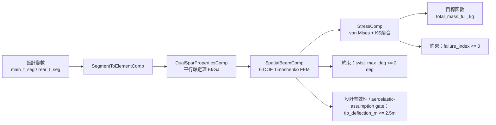

# Legacy Black Cat 004 Downstream Reference

> **文件定位**：歷史 / downstream reference。這份文件保存早期 README 中關於 Black Cat 004、
> OpenMDAO spar optimizer、dual-beam downstream、API/MCP 與 drawing package 的說明，避免這些內容
> 繼續混在 root README 裡誤導新 agent。
>
> **不要把本文件當成目前主線**。目前主線請看 [CURRENT_MAINLINE.md](../CURRENT_MAINLINE.md)。

## 歷史定位

早期 repo 主要被描述成：

```text
VSP / target cruise shape
-> inverse design
-> jig shape
-> realizable loaded shape
-> CFRP / discrete layup
```

這條線仍然有可重用工具價值，但它現在是 Phase J pipeline 中的 downstream / realization /
validation 子能力，不是新 aircraft concept 的 root workflow。

## 舊 OpenMDAO Component DAG

下面是早期 README 的 OpenMDAO spar optimizer 視角。它適合用來理解舊 dual-beam / spar sizing
工具，不適合拿來描述目前新 candidate 的完整設計流程。



歷史功能特色：

- OpenMDAO 6-DOF Timoshenko 梁模型。
- 分段碳纖維管設計；早期 Black Cat 004 半翼展配置使用 6 段 spar tube。
- dual-beam main / rear spar stiffness model。
- lift-wire support 以 wire attach station 的 vertical displacement constraint 表示。
- VSPAero `.lod` / `.polar` parser 與 load mapper。
- ANSYS APDL / Workbench CSV / NASTRAN BDF 匯出。
- FastAPI / MCP server 作為早期 AI automation wrapper。
- `val_weight: <float>` 作為早期 spar optimizer 目標函數 sentinel。

## 舊 Black Cat 004 Quickstart

下面指令只應用於歷史 Black Cat 004 / downstream spar optimizer 路徑，不應作為目前新設計主線的
第一個指令。

```bash
python examples/blackcat_004_optimize.py
python scripts/run_optimization.py --config configs/blackcat_004.yaml
```

舊流程大致為：

1. 載入 `configs/blackcat_004.yaml`。
2. 解析 VSPAero `.lod`。
3. 將氣動載荷對應至結構梁節點。
4. 最佳化各段管壁厚度。
5. 匯出 ANSYS / NASTRAN / CSV 與報告。

## 舊 Drawing-Ready Package

早期 drawing-ready package 位置：

```text
output/blackcat_004/drawing_ready_package/
```

相關文件：

- [drawing_ready_package.md](drawing_ready_package.md)

歷史注意事項：

- `geometry/spar_jig_shape.step` 是舊 drawing handoff 的主要 spar 幾何。
- `references/*` 是 loaded shape / cruise state 參考。
- `crossval_report.txt` 是 internal inspection reference，不是 validation truth。

## 舊 Generic VSP / Producer / Autoresearch 入口

這些工具仍可能有工程價值，但不應覆蓋 Phase J pipeline。

```bash
python scripts/analyze_vsp.py --vsp path/to/any.vsp3
uv run python -m hpa_mdo.producer --output-dir /abs/path/to/run_dir
uv run python -m hpa_mdo.autoresearch --output-dir /abs/path/to/run_dir
```

相關文件：

- [dual_beam_workflow_architecture_overview.md](dual_beam_workflow_architecture_overview.md)
- [dual_beam_decision_interface_v1_spec.md](dual_beam_decision_interface_v1_spec.md)
- [dual_beam_consumer_integration_guide.md](dual_beam_consumer_integration_guide.md)
- [dual_beam_autoresearch_quickstart.md](dual_beam_autoresearch_quickstart.md)

## 舊 Black Cat 004 Target Description

早期 README 把 Black Cat 004 描述為目標機：

- 翼展 33.0 m。
- 操作重量 96 kg。
- 海平面巡航速度 6.5 m/s。
- 翼根 Clark Y SM，翼尖 FX 76-MP-140。
- 漸進式上反角 0 到 6 deg。
- main spar 約在 25% chord，rear spar 約在 70% chord。
- 高模量碳纖維管。
- lift wire 約位於半翼展 7.5 m。

這些數字是歷史 Black Cat 004 context，不是目前新 aircraft concept 的設計約束。

## 高保真驗證歷史線

早期 README 也提到 Mac-local structural spot-check：

```text
summary -> STEP -> Gmsh -> CalculiX -> report / ParaView
```

這仍可作為 validation toolbox 的一部分，但目前主線信任邊界仍是：

- FEM / CalculiX / APDL 是 candidate-relevant spot-check；
- 不是 final composite / root fitting / wire hardware / rib joint sign-off；
- SU2 / mesh-native CFD 支線仍暫停，不能拿來當目前 performance truth。
