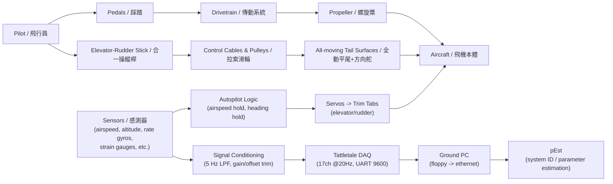
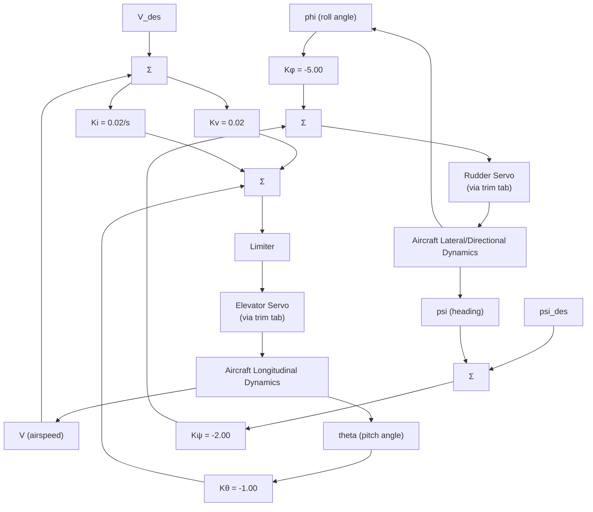

# MIT 人力飛機 HPA 控制系統深度研究報告

## 執行摘要

MIT「Daedalus（代達羅斯）」系列人力飛機的「控制系統」在公開技術文件中可清楚分成兩條線：**(1) 實際飛行的超輕量手動操縱與機械傳動**、**(2) 以「Light Eagle（原型機）」為主要測試平台的自動操縱（autopilot）/儀表與資料蒐集系統**。從可取得的一手資料來看，最具可複製價值、且有明確參數的控制內容，反而集中在「autopilot 設計驗證」與「飛行測試/系統辨識所需的儀測與資料流程」。citeturn26search11turn22view1turn13view2turn20view1  

關鍵可引用的工程結論如下：  
Daedalus 任務導向的極限輕量化，使其**取消副翼**、改以**方向舵單一操縱實現橫向/轉彎**（搭配機翼上反角/類上反角效應）。飛測顯示：轉彎時實際側滑角（sideslip）比設計分析工具（QUADPAN）預測大，直接削弱方向舵控制裕度，並與 1988 年 Daedalus 87 的事故風險相關；研究團隊以 4°/9°兩種上反角、以及「僅方向舵」對比「方向舵+副翼」等方式作為可控性驗證。citeturn31view3turn31view0  

自動操縱方面，MIT/NASA 團隊在報告中公開了**閉迴路方塊圖與控制增益**：  
* **空速保持（airspeed hold）**：回授俯仰角（pitch angle）增益 **−1.00**、空速誤差比例增益 **0.02**、空速誤差積分器 **0.02/s**，三者加總後輸出至升降舵伺服（elevator servo）並經過 limiter 限幅，以避免過大舵面指令。citeturn22view0turn22view1  
* **翼水平/航向保持（wing leveler + heading hold）**：以滾轉角（roll angle）回授增益 **−5.00**、航向誤差（heading error）回授增益 **−2.00** 形成方向舵（rudder）指令。citeturn22view1turn16view4  

更重要的是：這些控制律若忽略「極柔結構 + 非定常氣動」會失效。飛測與分析指出：當方向舵攻角迅速改變時，**約 0.14 s** 的氣動遲滯後升力才建立；其後又因尾樑（tailboom）柔性造成**額外約 0.3 s** 延遲，導致「舵面已動、力矩晚到」的現象，必須透過補償策略（compensation augmentation）才能獲得可接受的 autopilot 表現。citeturn17view2turn17view3turn20view1  

就「可複製」而言，公開資料可直接移植的不是某個專有飛控程式碼，而是：**(a) 低重量儀測/資料鏈設計（約 1 kg 等級）、(b) 用於柔性飛行器之小擾動飛測與系統辨識流程、(c) 控制律設計時將結構模態與氣動遲滯納入等效模型**。citeturn26search11turn13view0turn20view1turn27view3  

## 研究範圍與可引用的主要來源

**本報告的「MIT HPA 控制系統」範圍**以 Daedalus/Light Eagle 專案在公開文件中可驗證的內容為主：  
1) **機上手動操縱與機械連桿/拉索**（含 Daedalus 與 Light Eagle 的三視圖工程圖）。citeturn14view0turn38view0  
2) **autopilot 感測器/致動器評估、控制律方塊圖、柔性效應對飛控的影響**（MIT 為 entity["organization","NASA","us space agency"] 撥款計畫撰寫的飛測報告；作者為 entity["people","R. Bryan Sullivan","mit researcher"] 與 entity["people","Siegfried H. Zerweckh","mit researcher"]）。citeturn26search11turn22view1turn17view3  
3) **autopilot/顯示器硬體實作摘要**（entity["company","Bolton Engineering, Inc.","andover, ma, us"] 的專案文件）。citeturn33view0  
4) **資料蒐集電腦與系統辨識工具鏈**（Onset Tattletale + NASA pEst）。citeturn13view2turn27view3  
5) 以「至少三個」相近 HPA/超輕量學研專案作對照（Gossamer、Musculair、SUMPAC/SUHPA），聚焦其控制/操縱架構差異。citeturn29view0turn36view2turn29view3  

**重要限制（必須明說）**：公開資料中沒有完整釋出「Daedalus 最終航段實飛使用的 autopilot 程式碼/電路細節/可靠度數據」。能引用的是：autopilot 的設計概念、方塊圖增益、感測器/致動器測試方式，以及柔性/非定常效應造成的控制問題與補償方向。citeturn22view1turn17view3turn33view0  

image_group{"layout":"carousel","aspect_ratio":"16:9","query":["MIT Daedalus human powered aircraft flight photo","Michelob Light Eagle human powered aircraft flight photo","MIT Daedalus human powered aircraft blueprint","Daedalus human powered aircraft cockpit controls"],"num_per_query":1}

## 硬體與機械控制系統

### 操縱介面與舵面配置

**Daedalus（量產任務機）的核心選擇：取消副翼、以方向舵單獨完成橫向控制**。飛測報告明確指出：Light Eagle 有副翼，但「Daedalus aircraft did not have ailerons」，因此必須在橫向軸以方向舵控制為主；而在穩定轉彎測試中，研究團隊比較了不同上反角（4° vs 9°）與不同控制策略（僅方向舵 vs 方向舵+副翼）後，得到「上反角足夠時，副翼未必比方向舵更有效」的結論。citeturn31view3turn31view0  

同一組飛測數據還給出可直接引用的「轉彎操縱量級」：在一個穩態轉彎案例中，以約 **3° 的方向舵定值**建立轉彎後，側滑角逐步累積並穩定在約 **12°**。這個側滑量級的重要性在於：它會壓縮方向舵有效控制力矩，並被認為與 Daedalus 87 的可控性事故風險相關。citeturn31view3turn31view0  

**工程圖（Daedalus 三視圖）提供了「操縱器件」可複製細節**：座艙內可見「elevator-rudder stick（升降舵/方向舵合一操縱桿）」、「elevator trim（升降舵配平）」、「rudder drive pulley / elevator drive pulley（滑輪驅動）」與「LCD airspeed & altitude display（空速/高度顯示）」等。citeturn14view0turn38view0  

> 未公開/不確定處：操縱桿—拉索—舵面的實際幾何比（行程比、力回饋曲線）、以及 Daedalus 最終構型的「上反角/柔性誘導上反角」定量設計值，公開文件並未完整列出（僅見於飛測中以 4°/9°作為測試參數）。citeturn31view0turn31view3  

### 機械傳動與連桿（含配平/變距）

**傳動系統與配平/變距機構**並非「飛控」本身，但在 HPA 上直接影響可控性：因為駕駛必須在極低功率裕度下穩定輸出，同時兼顧操縱。工程圖顯示 Daedalus 使用變距螺旋槳與對應的 pitch linkage / pitch cable（變距連桿/拉索）配置。citeturn14view0  

具體到可引用的尺寸級資訊，entity["people","Mark Drela","aerospace engineer"] 在 MIT 公開的 Light Eagle 變距機構圖中標出：**2" ID prop shaft（2 吋內徑螺旋槳軸）**、pitch pushrod、0.75" ID prop “spoke”、Vespel 軸承、Teflon 墊圈等細節。這份圖對「想復刻變距機構」的價值大於對「控制律」本身。citeturn37view0  

### 感測器：飛行顯示、測試儀測、autopilot 候選

公開資料把感測器分成三類：  
1) **飛行顯示/任務必要感測**：工程圖可見以「freewheeling prop airspeed sensor（風車式螺旋槳空速感測）」與「Sonar altitude sensor（聲納高度感測）」服務低空貼地飛行；另含「2-way radio push-to-talk」作通聯。citeturn14view0turn38view0  
2) **飛測與系統辨識用儀測**：包括控制面位置（如以彈簧回復電位器量測副翼位置的方式）、結構應變計（tailboom 與 wing spar）、加速度計、率陀螺（rate gyro）等。citeturn11view0turn13view0turn13view2turn31view3  
3) **autopilot 候選感測器**：飛測報告明確寫到評估項目包含 **固態率陀螺、靜電感測器（electrostatic sensors）、磁羅盤**；其中陀螺與靜電感測器用於估測姿態（俯仰/滾轉），磁羅盤用於航向偏差感測，以形成「空速保持 + 翼水平」內迴路與「航向保持」外迴路。citeturn11view1turn16view2  

靜電感測器方案本身很「非常規」，但文件把工程風險講得很清楚：由於地電場梯度會日變，若不處理增益變化，autopilot 可能飽和甚至不穩定；為迴避此問題，Light Eagle 測試了「把感測器裝在小型風車螺旋槳端點、以 Hall effect 感測磁鐵通過，利用相位差推得滾轉角」的改良作法。citeturn11view1turn18view2  

### 致動器：trim tab + hobby servo 的超輕量作法

飛測報告記載：Light Eagle 測試的 autopilot 致動器為**遙控模型用小型伺服（small servos for radio controlled aircraft）**。它們不是直接驅動主舵面，而是驅動方向舵/升降舵後緣的 **trim tab**，再由 trim tab 的氣動力帶動主舵面偏轉；連桿設計使「伺服臂位置 ≈ 對應舵面偏角」（位置命令而非角速度命令）。citeturn11view2turn11view3  

文件也提供了可複製的等效動態：地面測試（把升降舵固定在梁上、架在皮卡車上以飛行速度前進）顯示舵面對 trim tab 指令的響應近似一階系統，並給出 **自然頻率 11.4 rad/s、阻尼比 0.7、時間延遲 0.1 s**。citeturn11view2turn12view3  

此外，為降低電磁干擾，座艙到致動器的命令傳輸使用**光纖（fiber optic cable）**；系統在飛行中運作良好，甚至在部分高空拖曳測試中用來設定並保持配平。citeturn12view2turn12view3  

## 控制架構、控制律與穩定性分析

### autopilot 控制架構：可引用方塊圖與增益

飛測報告在「3.4 Autopilot Design」段落提供了兩個核心方塊圖（Figure 3‑12、3‑13），並在文字敘述中交代其「穩定化→調節→消除穩態誤差」的流程。citeturn22view0turn22view1  

**空速保持（Airspeed Hold）**的控制律可直接按方塊圖轉寫成（以文件符號理解）：  
* 回授俯仰角 θ：增益 **−1.00**  
* 回授空速誤差（V_des − V）：比例增益 **0.02**  
* 空速誤差積分：**0.02/s**  
三路相加形成升降舵設定（elevator setting），再經 limiter 限幅，輸出至升降舵伺服系統。citeturn22view0turn22view1  

**翼水平/航向保持（Lateral Control: Wing Leveler + Heading Hold）**：  
* 回授滾轉角 φ：增益 **−5.00**  
* 回授航向誤差（ψ_des − ψ）：增益 **−2.00**  
相加後輸出方向舵設定（rudder setting）。citeturn22view1turn16view4  

> 未公開/不確定處：方塊圖未給出 limiter 的具體限幅值（例如最大升降舵偏角、最大配平速率），以及感測器濾波、取樣、量測噪聲模型等參數；這些在公開報告中沒有完整規格表。citeturn22view0turn22view1  

### 柔性結構與非定常氣動：為何「穩定裕度」不能只看剛體模態

MIT/NASA 團隊在報告中把「autopilot 為何難」歸因於兩個核心現象：  
1) **非定常氣動延遲**：方向舵攻角快速變化後，約 **0.14 s** 才出現相應升力變化。citeturn17view2turn20view1  
2) **尾樑柔性延遲**：升力建立後，尾樑彎曲/扭轉使力矩再延後約 **0.3 s** 才有效作用到機身。citeturn17view2turn20view1  

這兩段延遲（總量級約 0.44 s）會直接吃掉相位裕度，造成以剛體模型設計的 autopilot「性能顯著劣化」，必須用補償方法做增強，才能回到可接受表現。報告在總結中明確指出：名目 autopilot 若不納入柔性效應將不可接受，但「用簡單的補償技術增強」可達到足夠性能。citeturn17view3turn26search11  

### 可引用的模態/遲滯數值：Table 3‑2

報告以 Table 3‑2 濃縮列出「結構模態自然頻率（含 apparent mass）」、「剛體模態估計」與「氣動遲滯參數」。這些數字對重建控制設計/穩定裕度分析特別關鍵：citeturn20view1  

**結構自然頻率（對控制來說屬於必須避開或補償的頻帶）**  
*對稱模態（symmetric）*：0.6、1.0、1.6、2.5、3.0、4.5 Hz  
*反對稱模態（antisymmetric）*：0.6、0.9、1.4、2.8、3.9 Hz citeturn20view1  

**剛體估計（quasi‑steady）**  
phugoid：0.1 Hz（輕阻尼）  
short‑period：1 Hz（臨界阻尼）  
spiral：11 s（不穩定）  
dutch roll：10 Hz、5 Hz（過臨界阻尼）citeturn20view1  

**一階氣動遲滯近似**  
Wagner 函數一階擬合之 pole：0.14 Hz；在 1 Hz 的 reduced frequency：0.63。citeturn20view1  

#### 結構模態頻率分佈（文字圖表）

（單位：Hz；每個「█」約代表 0.2 Hz）

對稱模態：  
- 0.6  ███  
- 1.0  █████  
- 1.6  ████████  
- 2.5  █████████████  
- 3.0  ███████████████  
- 4.5  ███████████████████████  

反對稱模態：  
- 0.6  ███  
- 0.9  █████  
- 1.4  ███████  
- 2.8  ██████████████  
- 3.9  ████████████████████  

> 如何用於複製：若你要復刻類似飛控，控制迴路（尤其是姿態內迴路）閉迴路頻寬通常必須與 0.6–4.5 Hz 的結構頻帶做「乾淨分離」或設計 notch/相位補償；否則非常容易把柔性模態當成姿態回授，導致控制增益上不去、或上去就振盪。此推論直接建立在表列頻率與報告對延遲/柔性的說明上。citeturn20view1turn17view3  

### Daedalus「無副翼」設計對穩定/操縱裕度的影響

在典型飛機上，滾轉率主要由副翼控制；但 Daedalus 必須依賴方向舵引入偏航，再藉耦合產生滾轉。報告指出：以 Light Eagle 的副翼輸入會帶來「顯著反向偏航（adverse yaw）約 4 deg/s」且滾轉率相對慢（約 −1 deg/s），而方向舵更能產生近似協調轉彎。這說明在超輕量/大展弦比設計中，「橫向/方向耦合」可能徹底改寫控制面有效性排序。citeturn31view3  

## 軟體堆疊、資料流程與模擬工具

### 機上軟體：Tattletale 資料蒐集電腦（不是傳統 RTOS）

飛測資料蒐集系統（DAS）使用 **Onset Tattletale** 電腦：體積約 **12 × 6.7 × 3.6 cm**，含 **512K RAM、10‑bit A/D、UART**，並以數位輸出線驅動外部多工器。citeturn13view1turn13view2  

軟體層面，Tattletale「可跑 BASIC 與 assembly」，資料蒐集核心為追求速度多用組語：  
* 一般飛測：**17 個通道、8‑bit 資料、20 Hz**（搭配 5 Hz 一階低通濾波以減少 aliasing）。citeturn13view2turn13view1  
* 功率量測（扭矩與轉速）：訊號濾波 **15 Hz**、記錄 **50 Hz**（8‑bit）。citeturn13view2  

> 未公開/不確定處：Tattletale 的程式碼結構（模組分層、記憶體佈局、資料封包格式）在公開報告中沒有貼出；只能根據描述推定其為「多工掃描 + 固定取樣率 + RAM 緩衝 + UART 下載」的典型資料記錄韌體。citeturn13view2  

### 地面資料鏈與後處理：快速迭代的「飛測—分析—再飛測」節奏

報告描述了非常工程化的日迭代流程：  
飛行後立即從機上電腦把資料下載到地面 PC、寫入軟碟，接著在 **Compaq DeskPro 386** 上讀取，並透過 **Ethernet** 傳到 NASA 主機，使用名為 **pEst** 的參數估測程式做系統辨識；當晚即可得到初步參數與操縱機動圖形，用於隔天飛測規劃與讓飛行員在飛行模擬器上練習新機動。citeturn13view0turn26search11  

下載通訊參數也被明確寫出：機上資料以 **9600 baud modem** 下載到攜帶式 PC，下載時間約等於飛行時間（典型約 10 分鐘）。citeturn13view2turn13view4  

### 系統辨識工具：pEst（FORTRAN 77、可互動、支援非線性）

pEst 使用手冊說明：pEst 是 **FORTRAN 77** 的互動式參數估測程式，可讓使用者以 FORTRAN 子程式定義「非線性方程式（equations of motion）」並以成本函數衡量量測與模型響應差距，再用多種最小化法（如 Newton‑Raphson、Davidon‑Fletcher‑Powell 等）尋找未知參數。citeturn27view3  

對 HPA 這類「柔性 + 非線性/延遲」系統而言，pEst 的價值在於：它能把「延遲、濾波、柔性等效模型」放進方程式後，直接用飛行資料估參數——這正是報告中將 0.14 s 氣動延遲與 0.3 s 尾樑延遲納入後，導數估計變好的原因之一。citeturn17view2turn27view3  

### 飛行模擬與空力/穩定導數工具：QUADPAN、訓練模擬器

報告指出 autopilot 設計採用了 **QUADPAN** 的穩定導數估計（並假設剛體動力學），但飛測發現轉彎側滑角「遠高於 QUADPAN 預測」，凸顯對這類超低速/大展弦比飛行器，某些導數（例如側滑相關的力矩/力係數）會比傳統飛機更關鍵。citeturn31view3turn31view0  

至於「飛行模擬器本身」，公開文件僅能證明其存在與用途：AeroModeller 文章提到 entity["people","Steve Finberg","engineer"] 建了一套飛行模擬器用於訓練，讓飛行員能練習機動並維持備飛狀態。citeturn11view11  

> 未公開/不確定處：訓練模擬器的數學模型（6‑DoF/柔性、空力查表方式）、程式碼與操作介面並未在可取得文件中釋出。citeturn11view11  

## 測試/驗證、數據記錄與安全失效設計

### 測試方法：小擾動飛測 + 頻率掃描 + 轉彎側滑觀察

由於人力飛機「功率裕度小、結構安全裕度也小」，報告強調飛測機動必須嚴格受限，因此以**小擾動機動（small‑perturbation maneuvers）**為核心，仍可滿足線性化模型與穩定導數估測需求。citeturn13view4turn18view0  

具體使用的機動包括：  
* **穩態轉彎**（觀察側滑角、比較上反角與控制策略）。citeturn31view0turn31view3  
* **控制面 pulse/doublet**（激發 Dutch roll、roll‑convergence、spiral‑divergence 等橫向模態）。citeturn12view4turn12view5  
* **頻率掃描（frequency sweep）**（評估剛體模態與柔性模態的交互影響）。citeturn12view6turn16view6  

此外，報告提到為了避免踩踏造成的週期性輸入干擾資料品質，部分飛測採「拖曳至高度後釋放、以無動力滑翔進行」的方式。citeturn26search11  

### 資料記錄與訊號調理：可直接複製的低成本做法

訊號調理板的架構相當「教科書式可複製」：每板最多 10 個感測器通道、經 ferrite bead 抑制長導線噪聲、再進 **5 Hz 一階低通**；多數通道可用可變電位器調整增益，部分通道可調增益與 offset，以最大化解析度、降低量化誤差；四塊板並聯輸入到 Tattletale 的多工/ADC。citeturn13view1turn13view2  

報告也給出系統級重量約束：整套機上 DAS 與感測器/調理電路「約 1 公斤」量級，這是 HPA 設計能否加裝儀表的硬門檻。citeturn26search11  

### 功率/重量權衡：用「可量測的功率曲線」決定控制目標

Airspeed hold 的設計目標是讓飛機維持在最大升阻比附近（或最低功率/最低阻力附近）的速度。報告提供一組理論功率需求表（Table 4‑3），可直接拿來做「最佳速度」估算：  
在 **6.50–6.75 m/s** 時功率需求最低（約 **149.9 W**），兩側（更慢或更快）功率需求上升。citeturn31view1turn22view0  

這裡同時提供一個實務教訓：表中功率數值與速度刻度可能受空速感測器尺度誤差影響，但報告指出該誤差不致破壞以「分段定速」方式推估最佳速度的能力。citeturn31view1  

#### 功率需求 vs 空速（文字圖表）

（W；每個「█」約 5 W；資料來自 Table 4‑3）

- 5.00 m/s：175.3 W  ████████████████████████████  
- 5.75 m/s：156.7 W  ████████████████████████  
- 6.50 m/s：149.9 W  ███████████████████████  
- 6.75 m/s：149.9 W  ███████████████████████  
- 7.50 m/s：157.4 W  ████████████████████████  
- 8.25 m/s：174.6 W  ████████████████████████████  
- 9.00 m/s：201.4 W  ██████████████████████████████████████  

### 安全與失效保護：已公開的機制與未公開的缺口

**已公開、可引用的安全設計點**：  
* autopilot 輸出有 **limiter**，避免過大升降舵指令。citeturn22view0turn22view1  
* 致動器命令以光纖傳輸，降低 EMI 造成錯誤指令的風險。citeturn12view2turn12view3  
* DAS 有前艙控制面板：飛行員可啟動/停止記錄；有 LED 指示正在記錄；記憶體滿會亮第二顆 LED 讓飛行員中止測試以下載資料。citeturn13view4  

**與事故/風險直接相關且可引用的觀察**：  
* Daedalus 87 的事故後，DAS 反而成為分析可控性限制因素的重要工具；並據此把改動加入 Daedalus 88 以提高可控性裕度。citeturn13view3turn34view0  
* 轉彎側滑角高於預期會降低方向舵控制裕度，並被明確提到與事故風險相關。citeturn31view0turn31view3  

**未公開/缺口（必須明說）**：  
公開文件沒有給出（a）autopilot 與手動操縱的「優先權/接管邏輯」細節、（b）致動器失效（卡死/斷電）時的可控性分析、（c）冗餘感測器配置與故障偵測隔離（FDI）策略。這些通常屬於飛控安全工程的核心，但在 Daedalus 專案的公開材料中未形成完整規格表。citeturn22view0turn33view0turn26search11  

## 類似專案對照與可複製的實務教訓

### 控制/操縱策略對照表

| 專案 | 類型與目標 | 主要操縱/控制面 | 控制系統特色（手動/自動） | 關鍵教訓（與 MIT Daedalus 對照） |
|---|---|---|---|---|
| MIT Daedalus / Light Eagle | 超輕量 HPA、長航程/貼地飛行；Light Eagle 為原型機 | Daedalus：無副翼、以方向舵主導橫向；Light Eagle 有副翼、全動平尾 | 發表了 autopilot 方塊圖與增益；trim‑tab + 伺服致動；柔性/非定常導致延遲與補償需求 | 「把柔性/延遲納入控制設計」是能否閉迴路的分水嶺；以及「在重量約束下以配平/trim‑tab 伺服做自動操縱」是可行路線 citeturn31view3turn22view1turn17view3turn11view2 |
| Gossamer Albatross II | 超輕量 HPA（Gossamer 系列），以最低功率為核心 | canard elevator、pusher propeller；含「tilting canard rudder」等非典型控制方式 | NASA 贊助的穩定與控制分析/飛測；文件明確談到「穩定操縱不是最低功率設計的第一順位，因而暴露並解決多項穩定/控制問題」 | 與 Daedalus 類似：達到最低功率後，會被「控制權/操縱品質」反噬；必須用飛測+分析反覆修正控制有效性與耦合模型 citeturn29view0turn35view0 |
| Musculair 1/2 | HPA（競賽飛行/速度與航程） | 三舵面（副翼/方向舵/升降舵）；「自回中」副翼與方向舵 | 強調人因：單一搖桿同時操縱三舵面（側傾=副翼、垂直軸旋轉=方向舵、手把扭轉=升降舵）；方向舵以彈簧維持中立以降低操縱負擔 | 對比 Daedalus：若保留副翼，可用更直覺的人因操縱把「操縱精準度」與「輸出功率」做權衡；而自回中機構相當於被動的「操縱穩定化」citeturn36view0turn36view2 |
| SUMPAC / SUHPA | 學研人力飛機（歷史上第一批成功人力起飛）；後續 SUHPA 以現代材料重建 | SUMPAC：傳統固定翼配置；SUHPA：碳纖維結構 | SUMPAC 首飛距離約 64 m，但「非常難轉彎」以致無法完成 8 字航線；SUHPA 則被描述為設計時考慮 autopilot 以利轉成 UAV 應用 | 對比 Daedalus：早期 HPA 的共同瓶頸就是「轉彎/橫向控制權不足」，而現代化重建會把 autopilot 當成一開始就要設計進去的系統工程要素 citeturn29view3turn28search7 |

### 可複製的實務教訓（以「能落地」為主）

**把「控制權」當成一等公民，不要等到破紀錄後才補救**  
Daedalus/Light Eagle 的飛測一再顯示：側滑與橫向耦合現象會讓方向舵控制權突然不足，並與事故風險相連。要複製這類飛機，應把「側滑角上限、方向舵力矩裕度、在擾動下回正能力」明確寫成需求。citeturn31view0turn17view3  

**autopilot 不一定要全權操縱：用 trim‑tab 伺服做「慢迴路」更符合重量與安全**  
公開資料顯示 Light Eagle 測試的致動路徑是「伺服→trim tab→主舵面」，本質上比較像「配平/慢控制」而非戰機級全權 FBW。它的好處是重量低、功耗低，且機械上較容易讓人接管；同時 limiter 能限制不合理指令。citeturn11view2turn22view0  

**用小擾動飛測 + 系統辨識迭代，是 HPA 控制工程的核心方法**  
這套專案證明：即使飛機功率裕度很小，仍能藉由 doublet、frequency sweep、穩態轉彎等機動取得足夠資料，並透過 pEst 在每天回合內更新導數/模型與控制策略。若要複製，應把資料鏈（取樣率、濾波、校正、快速後處理）視為飛控的一部分。citeturn13view0turn13view2turn27view3  

**把「柔性延遲」明確塞進控制模型（即使是 ad‑hoc 等效）**  
報告將延遲拆成 0.14 s（氣動）+ 0.3 s（結構），並指出名目 autopilot 會因此不可用。這告訴復刻者：就算你沒有完整 aeroelastic 模型，也要做等效 delay/低通/相位補償，否則閉迴路性能不可預期。citeturn17view2turn20view1turn17view3  

### 系統架構與控制迴路示意（Mermaid）

**整體系統架構（手動操縱 + autopilot/儀測 + 地面分析鏈）** citeturn14view0turn13view2turn22view1  


**autopilot 控制迴路（依公開方塊圖增益）** citeturn22view1turn22view0  


## 參考文獻與連結

以下列出本報告引用的「可直接下載/開啟」一手技術文件與主要對照資料（含原始連結；多數為英文）。  

**MIT / Daedalus / Light Eagle 核心文件**  
1) *Daedalus 三視圖工程圖（含重量/速度/操縱配置）*（MIT 公開）citeturn14view0  
```text
https://web.mit.edu/drela/Public/web/hpa/daedalus.pdf
```

2) *Michelob Light Eagle 三視圖工程圖（含副翼、重量/速度等）*（MIT 公開）citeturn38view0  
```text
https://web.mit.edu/drela/Public/web/hpa/light_eagle.pdf
```

3) *Flight Test Results for the Daedalus and Light Eagle Human Powered Aircraft*，R. Bryan Sullivan & Siegfried H. Zerweckh，Oct 1988（MIT 為 NASA 計畫撰寫之技術報告；含 autopilot 方塊圖、儀測、pEst 流程、柔性/延遲參數等）citeturn26search11turn22view1turn13view2turn20view1  
```text
https://ntrs.nasa.gov/api/citations/19890001519/downloads/19890001519.pdf
```

4) *Daedalus Human Powered Airplane Instrumentation*（Bolton Engineering 專案摘要；描述 autopilot 子系統：rate gyro 積分、80C31 顯示電腦、5V 供電等）citeturn33view0  
```text
https://www.boltoneng.com/projects/files/human-powered-aircraft.pdf
```

5) *Light Eagle (Daedalus Prototype) Variable‑Pitch Mechanism*，M. Drela，30 Oct 2020（變距機構尺寸/材料細節）citeturn37view0  
```text
https://web.mit.edu/drela/Public/web/hpa/mle_vpitch.pdf
```

6) *The Feasibility of A Human-powered Flight Between Crete and the Mainland of Greece*（Daedalus feasibility study，Vol I & II；掃描版，主要偏任務/設計可行性與空力/結構設計資料）citeturn11view4turn27view0  
```text
https://web.mit.edu/drela/Public/web/hpa/Daedalus_feasibility_study_I.pdf
https://web.mit.edu/drela/Public/web/hpa/Daedalus_feasibility_study_II.pdf
```

**工具鏈 / 系統辨識與相關手冊**  
7) *The pEst Version 2.1 User’s Manual*，J. E. Murray，1987（NASA；FORTRAN 77 互動式參數估測）citeturn27view3  
```text
https://ntrs.nasa.gov/api/citations/19870018884/downloads/19870018884.pdf
```

8) *NASA 與 Daedalus 計畫簡介頁（含 Light Eagle/Daedalus 87/88 里程碑與重量描述）*citeturn34view0  
```text
https://www.nasa.gov/image-article/daedalus-human-powered-aircraft/
```

9) *Panel Methods—An Introduction (NASA TP‑2995)*（用於了解 QUADPAN 這類 panel code 的背景；若要復刻穩定導數估算流程可參考）citeturn24search1  
```text
https://ntrs.nasa.gov/api/citations/19910009745/downloads/19910009745.pdf
```

**相近 HPA/超輕量專案對照**  
10) *Stability and Control of the Gossamer Human‑Powered Aircraft by Analysis and Flight Test*，H. R. Jex & D. G. Mitchell，NASA CR‑3627，Oct 1982（Gossamer 系列控制方式與飛測）citeturn29view0turn35view0  
```text
https://ntrs.nasa.gov/api/citations/19830002792/downloads/19830002792.pdf
```

11) *The Musculair 1 & 2 Human‑Powered Aircraft and Their Optimisation*，E. Schoberl（含三舵面 joystick 人因操縱映射、自回中方向舵等）citeturn36view0turn36view2  
```text
https://www.humanpoweredflight.co.uk/hpfMedia/media/7/musculair-paper.pdf
```

12) *University of Southampton：SUMPAC 歷史頁（含「難以轉彎」問題、SUHPA 與 autopilot 構想）*citeturn29view3  
```text
https://www.southampton.ac.uk/engineering/about/making-history/sumpac.page
```