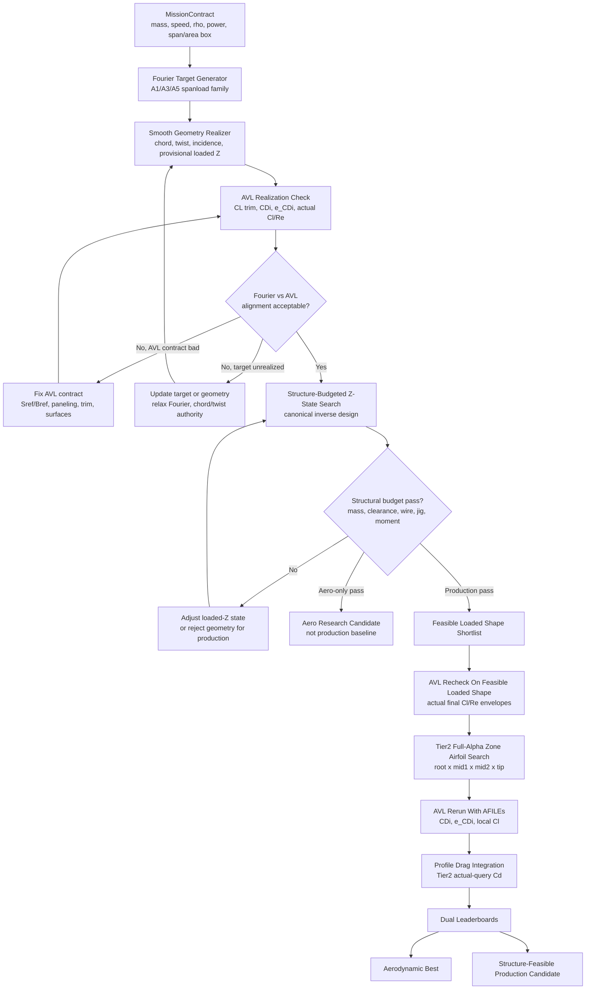
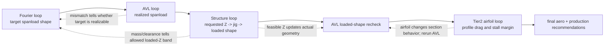

# Pipeline Flowchart

## High-Level Flow

## Loop Ownership

## Gate Timing

| Timing | Gate | Action |
|---|---|---|
| Before AVL | Search-box sanity | Reject impossible mass/span/CL cases early |
| After first AVL | Fourier-AVL realization | Update target/geometry or reject target |
| Before airfoil finalization | Structure budget | Search loaded-Z state and jig feasibility |
| After feasible loaded shape | AVL recheck | Freeze actual Cl/Re envelopes |
| After Tier2 combo search | Airfoil quality | Rank aero and production candidates |

## Important Non-Goals

- Do not rerun broad CST/NSGA just to solve a Z-state problem.
- Do not make Fourier power the ranking authority after AVL is available.
- Do not promote Phase 9 proxy or Phase 10 sidecar-only outputs to structural truth.
- Do not select final airfoils before feasible loaded shape and AVL actual Cl/Re are known.
