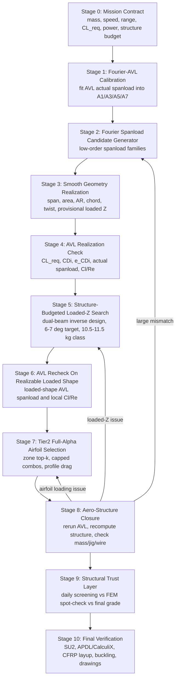

# Pipeline v2 Flowchart

## High-Level Flow



## Where Each Major Concept Enters

```mermaid
flowchart LR
    M["Mission<br/>42.195 km, 6.5-6.7 m/s, crank power"] --> FAVL["Fourier-AVL Calibration"]
    FAVL --> FGEN["Fourier candidate language"]
    FGEN --> AVL1["AVL actual spanload"]
    AVL1 --> Z["Structure-budgeted loaded Z / effective dihedral"]
    Z --> JIG["Canonical inverse design / jig shape"]
    JIG --> AVL2["AVL recheck on realizable loaded shape"]
    AVL2 --> T2["Tier2 full-alpha airfoil database"]
    T2 --> CLOSE["Aero-structure closure"]
    CLOSE --> FEM["CalculiX / ANSYS / shell FEM trust layer"]
```



## Important Ordering Rule

```text
Tier2 airfoil selection must come after the structurally feasible loaded shape,
because it needs the actual AVL Cl/Re envelope.
```

## Non-Goals In This Spec

- no optimization run,
- no production ranking change,
- no new hard gate,
- no broad CST/NSGA rerun,
- no final structural signoff.
